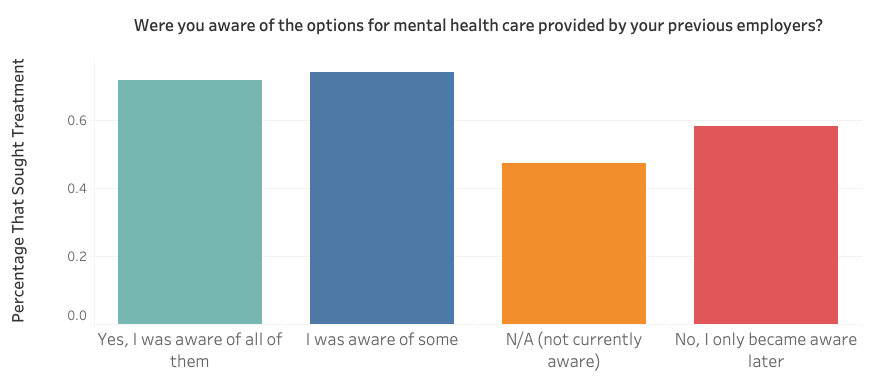

 

# **Project 5: Factors For Seeking Mental Health Treatment In Tech**
---
## **Problem Statement**
---

The goal of this project is to help tech companies find the most important factors in determining whether employees seek the mental health treatment they need. Utilizing a machine learning model, we can help employers in tech promote the best environment to encourage employees to seek mental health treatment if they are in need.

## **Executive Summary**
---

#### **Data Extraction**
---

The data was pulled from Kaggle using the Kaggle API for datasets (https://www.kaggle.com/datasets/osmi/mental-health-in-tech-2016)

#### *Data Cleaning*
---

The original data set involved 1433 rows and 63 columns. The first step taken in cleaning the data was dropping all columns that did not relate to our problem statement. Next was dropping all columns that had more than 50% of the data missing. After that filling the missing data with the most frequent of the column was next. Then change the gender column to only 3 unique values. The last step was to pd.get_dummies the columns that had more than 2 unique values.

#### *Exploratory Data Analysis & Data Visualization*
---
##### Male vs Female That Sought Treatment

###### Awareness of Mental Health Provided

#### **Modeling & Accuracy**
---

In the modeling of the cleaned dataset we used Random Forest Classifier to score the data. The random state was set at 42, then a grid search was used to get the best rsults and the best best max depth was at 8 and also the n-estimator at 250 were the best paremeters.

 ## **Conclusions and Recommendations**
 --- 
 
In conclusion our model had an accuracy of over 72%, which is good when dealing this dataset because alot of the questions in the dataset were subjective. The most import factors that went into a person seeking mental help were gender, employer providing mental health beneifits as part of their healthcare coverage and employee awareness of the mental healthcare options. In next steps there can be a focus on the male gender because it seems they were greatly less prone to seek treatment seek mental health treatment than the other gender.

 
 